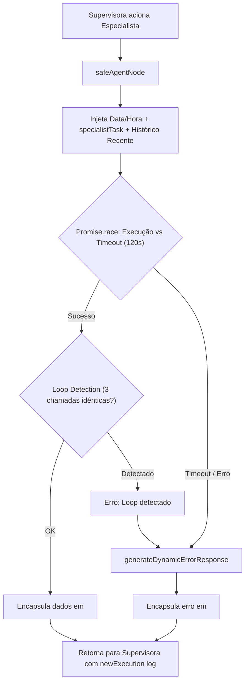

# 05. Agentes Especialistas & Execução Segura

Os **Agentes Especialistas** residem em `src/agents/` e são nós executores do LangGraph. Cada agente é responsável por um domínio específico e atua coletando dados brutos ou executando comandos solicitados pela Supervisora.

---

## 🛡️ O Padrão `safeAgentNode`

Para evitar travamentos em produção, loops infinitos ou vazamento de contexto desnecessário, todos os especialistas são executados através da função `safeAgentNode` ([`src/agents/workspace/base.ts`](../../src/agents/workspace/base.ts)).



### Principais Guardrails do `safeAgentNode`:
1. **Timeout Estrito de 120s:** Nenhuma chamada a APIs externas (Google, Groq, Baileys) pode travar a aplicação indefinidamente.
2. **Detector de Loop (`LoopDetectionCallbackHandler`):** Interrompe imediatamente caso uma mesma ferramenta seja chamada 3 vezes consecutivas com os mesmos argumentos.
3. **Ancoragem de Histórico Inteligente:**
   - Se a Supervisora forneceu `specialistTask`, o especialista recebe **apenas** a instrução cirúrgica (evitando que ele se distraia com mensagens antigas).
   - Exceção: O `missionAgent` recebe as 6 mensagens mais recentes para interpretar a fala real do terceiro.
4. **Mensagem de Retorno Estruturada (`<specialist_return>`):**
   ```xml
   <specialist_return agent="searchAgent">
     <collected_data>
       Preço encontrado: R$ 4.899,00 na Amazon Brasil. Link: https://amazon.com.br/...
     </collected_data>
     <routing_instruction>
       Se ainda houver etapas pendentes no plano, continue a execução...
     </routing_instruction>
   </specialist_return>
   ```

---

## 👥 Detalhamento dos Principais Especialistas

### 1. Workspace Suite (`src/agents/workspace/`)
Conecta a Bia às APIs do Google Workspace através do protocolo **Model Context Protocol (MCP)** via `MultiServerMCPClient`:
- **`calendarAgent`:** Consulta agendas, cria e edita compromissos com fuso horário `America/Sao_Paulo`.
- **`gmailAgent`:** Busca e-mails na caixa de entrada, lê threads e envia mensagens.
- **`driveAgent` / `docsAgent` / `sheetsAgent`:** Busca arquivos no Google Drive, lê documentos e planilhas (retornando CSV estruturado).
- **Auto-recuperação de OAuth:** Se o `GOOGLE_REFRESH_TOKEN` for alterado no arquivo `.env`, o `initWorkspaceTools(force)` reinicializa as conexões MCP em quente sem reiniciar o servidor.

### 2. Agentes de Busca & Informação do Mundo Real
- **`searchAgent` ([`src/agents/search.ts`](../../src/agents/search.ts)):** Busca no Google Custom Search API e leitura completa de páginas com `open_webpage` (Cheerio/HTTP).
- **`shoppingAgent` ([`src/agents/shopping.ts`](../../src/agents/shopping.ts)):** Google Shopping com filtragem heurística para priorizar e-commerces nacionais confiáveis (Amazon, Mercado Livre, Magalu, KaBuM!) e descartar importações de risco.
- **`weatherAgent` ([`src/agents/weatherAgent.ts`](../../src/agents/weatherAgent.ts)):** Consulta em tempo real à API aberta OpenMeteo com geolocalização e previsão para os próximos dias.

### 3. Agentes de Gestão, Memória e Operação
- **`memoryAgent` ([`src/agents/memoryAgent.ts`](../../src/agents/memoryAgent.ts)):** Gerencia a memória cognitiva RAG no SQLite e os **Documentos Vivos de Contexto (Scoped Living Documents)** associados a tópicos. Permite registrar fatos (`storeSemanticMemory`), realizar buscas vetoriais com reforço (`searchSemanticMemory`), compilar dossiês (`searchEventSummary`), excluir memórias (`deleteSemanticMemory`) e manipular documentos vivos (`get_context_document`, `append_context_document`, `overwrite_context_document`, `compact_context_document`).
- **`taskAgent` ([`src/agents/taskAgent.ts`](../../src/agents/taskAgent.ts)):** Gerencia afazeres na tabela `tasks` do SQLite. Identifica promessas ou cobranças automáticas no título e sincroniza com o `followUpAgent`.
- **`routineAgent` ([`src/agents/routineAgent.ts`](../../src/agents/routineAgent.ts)):** Converte pedidos em linguagem natural para expressões Cron, cria, atualiza e agenda execuções recorrentes ou lembretes pontuais com suporte a JIDs equivalentes (LID / número).
- **`trackerAgent` ([`src/agents/trackerAgent.ts`](../../src/agents/trackerAgent.ts)):** Gerencia documentos JSON estruturados para controle de estoques, manutenções veiculares ou inventários da casa.

### 4. Raciocínio Profundo
- **`reasoningAgent` ([`src/agents/reasoningAgent.ts`](../../src/agents/reasoningAgent.ts)):** Aciona o modelo **DeepSeek Pro Thinking Mode** (`modelPro` com orçamento de tokens de reflexão) para resolver problemas matemáticos, lógica complexa e decisões estratégicas.

---

## 🔗 Próximos Passos & Documentos Relacionados

- Para entender os subsistemas de memória consumidos pelos agentes:  
  👉 [06. Sistema de Memória & RAG Híbrido](06-sistema-de-memoria-e-rag.md)
- Para entender o CRM e resolução de pessoas:  
  👉 [07. CRM Pessoal & Grafo de Entidades](07-crm-e-grafo-de-entidades.md)
- Para entender a auditoria e qualidade das respostas geradas:  
  👉 [12. Avaliação de Qualidade & Segurança](12-avaliacao-qualidade-e-seguranca.md)
