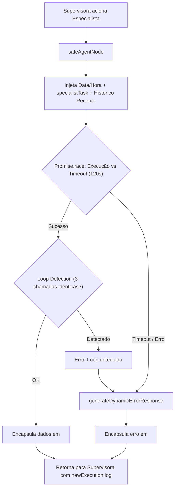

# 05. Agentes Especialistas & Execução Segura

Os **Agentes Especialistas** residem em `src/agents/` e são nós executores do LangGraph. Cada agente é responsável por um domínio específico e atua coletando dados brutos ou executando comandos solicitados pela Supervisora.

---

## 🛡️ O Padrão `safeAgentNode`

Para evitar travamentos em produção, loops infinitos ou vazamento de contexto desnecessário, todos os especialistas são executados através da função `safeAgentNode` ([`src/agents/workspace/base.ts`](../../src/agents/workspace/base.ts)).



### Principais Guardrails do `safeAgentNode`:
1. **Timeout Estrito de 120s:** Nenhuma chamada a APIs externas (Google, Groq, Baileys) pode travar a aplicação indefinidamente.
2. **Detector de Loop (`LoopDetectionCallbackHandler`):** Interrompe imediatamente caso uma mesma ferramenta seja chamada 3 vezes consecutivas com os mesmos argumentos.
3. **Ancoragem de Histórico Inteligente:**
   - Se a Supervisora forneceu `specialistTask`, o especialista recebe **apenas** a instrução cirúrgica (evitando que ele se distraia com mensagens antigas).
   - Exceção: O `missionAgent` recebe as 6 mensagens mais recentes para interpretar a fala real do terceiro.
4. **Mensagem de Retorno Estruturada (`<specialist_return>`):**
   ```xml
   <specialist_return agent="searchAgent">
     <collected_data>
       Preço encontrado: R$ 4.899,00 na Amazon Brasil. Link: https://amazon.com.br/...
     </collected_data>
     <routing_instruction>
       Se ainda houver etapas pendentes no plano, continue a execução...
     </routing_instruction>
   </specialist_return>
   ```

---

## 👥 Especificação Exaustiva dos 19 Especialistas

O ecossistema da Bia conta com **19 Agentes Especialistas**, organizados em 6 categorias funcionais:

### 1. Workspace Suite (`src/agents/workspace/`)
Conecta a Bia às APIs oficiais do Google Workspace através do protocolo **Model Context Protocol (MCP)** via `MultiServerMCPClient`:
- **`calendarAgent` ([`src/agents/workspace/calendar.ts`](../../src/agents/workspace/calendar.ts)):** Consulta calendários, localiza conflitos, agenda e edita compromissos com timezone fixado em `America/Sao_Paulo`.
- **`gmailAgent` ([`src/agents/workspace/gmail.ts`](../../src/agents/workspace/gmail.ts)):** Busca mensagens na caixa de entrada por remetente/assunto, lê threads e rascunha ou envia e-mails (`requiresTrusted: true`).
- **`driveAgent` ([`src/agents/workspace/drive.ts`](../../src/agents/workspace/drive.ts)):** Busca, lista, faz upload e lê arquivos no Google Drive, além de criar pastas e gerenciar permissões (`drive_list_files`, `drive_search_files`, `drive_read_file`, `drive_create_folder`, `drive_upload_file`, `drive_share_file`).
- **`docsAgent` ([`src/agents/workspace/docs.ts`](../../src/agents/workspace/docs.ts)):** Cria e lê documentos Google Docs, anexando notas ou resumos estruturados.
- **`sheetsAgent` ([`src/agents/workspace/sheets.ts`](../../src/agents/workspace/sheets.ts)):** Busca, lista e extrai dados tabulares de planilhas Google Sheets em formato CSV legível.
- **Auto-recuperação de OAuth:** Se o `GOOGLE_REFRESH_TOKEN` for alterado ou renovado no `.env`, a função `initWorkspaceTools(force)` recarrega as conexões MCP em quente sem derrubar o processo.

### 2. Busca & Informação do Mundo Real
- **`searchAgent` ([`src/agents/search.ts`](../../src/agents/search.ts)):** Busca no Google Custom Search API e leitura profunda de páginas com `open_webpage` (Cheerio/HTTP). Restrito a 3 buscas por execução para economia de cota.
- **`shoppingAgent` ([`src/agents/shopping.ts`](../../src/agents/shopping.ts)):** Google Shopping com filtragem heurística para priorizar grandes varejistas nacionais (Amazon, Mercado Livre, Magalu, KaBuM!, Fast Shop) e descartar marketplaces de risco ou tributação internacional.
- **`weatherAgent` ([`src/agents/weatherAgent.ts`](../../src/agents/weatherAgent.ts)):** Consulta em tempo real à API aberta OpenMeteo com geolocalização e previsão estendida para cidades brasileiras (ex: Campinas, São Paulo) com temperatura, chuva e vento.

### 3. Gestão, Memória e Operação
- **`memoryAgent` ([`src/agents/memoryAgent.ts`](../../src/agents/memoryAgent.ts)):** Gerencia a memória cognitiva RAG no SQLite e os **Documentos Vivos de Contexto (Scoped Living Documents)** associados a tópicos (`context_documents`).
  - *Ferramentas RAG:* `storeSemanticMemory`, `searchSemanticMemory`, `searchEventSummary`, `readMemory`, `consolidateMemory`, `deleteSemanticMemory`.
  - *Ferramentas Living Docs:* `get_context_document`, `append_context_document`, `overwrite_context_document`, `compact_context_document`.
- **`taskAgent` ([`src/agents/taskAgent.ts`](../../src/agents/taskAgent.ts)):** Gerencia a tabela `tasks` no SQLite (`add_task`, `list_tasks`, `complete_task`, `delete_task`). Detecta compromissos bilaterais no título e sincroniza automaticamente com o `followUpAgent`.
- **`routineAgent` ([`src/agents/routineAgent.ts`](../../src/agents/routineAgent.ts)):** Traduz pedidos em linguagem natural para expressões Cron e gerencia a tabela `routines` (`create_routine`, `update_routine`, `list_routines`, `delete_routine`). Ao cancelar uma rotina via `delete_routine`, desativa o registro no banco (`isActive = 0`) e remove imediatamente o job da memória do agendador (`descheduleRoutine`). Além disso, o agendador possui validação defensiva Just-in-Time pré-disparo para auto-desagendar da memória caso o registro tenha sido deletado ou desativado externamente no banco. Suporta lembretes únicos com dia/mês explícitos e rotinas recorrentes.
- **`trackerAgent` ([`src/agents/trackerAgent.ts`](../../src/agents/trackerAgent.ts)):** Gerencia inventários, manutenções veiculares e despensas complexas armazenadas como JSON estruturado na tabela `trackers` (`create_tracker`, `list_trackers`, `get_tracker`, `update_tracker`, `delete_tracker`).
- **`crmAgent` ([`src/agents/crmAgent.ts`](../../src/agents/crmAgent.ts)):** Constrói e consulta o grafo de conhecimento relacional do Luiz (`entities` e `entity_relationships`) com `save_entity`, `add_relationship`, `get_entity_context` e `search_entities`.

### 4. Comunicação & Mensageria WhatsApp
- **`whatsappAgent` ([`src/agents/whatsappAgent.ts`](../../src/agents/whatsappAgent.ts)):** Especialista em histórico local de mensagens, busca de JIDs e resumos de grupos (`listRecentChats`, `getChatHistory`, `searchChatByName`, `searchGroups`, `generate_daily_summary`, `add_daily_summary_group`, `remove_daily_summary_group`, `list_daily_summary_groups`).
- **`missionAgent` ([`src/agents/missionAgent.ts`](../../src/agents/missionAgent.ts)):** Conduz conversas autônomas com contatos de terceiros (fornecedores, prestadores de serviço) via WhatsApp (`start_mission`, `list_missions`, `complete_mission`, `update_mission_notes`, `send_message_to_target`, `notify_master`), com TTL e isolamento.
- **`followUpAgent` ([`src/agents/followUpAgent.ts`](../../src/agents/followUpAgent.ts)):** Acompanha cobranças pendentes de terceiros (*Waiting for Them*) e promessas assumidas pelo Luiz (*Promised by Me*) com `add_follow_up`, `list_follow_ups`, `resolve_follow_up`, `cancel_follow_up` e `update_follow_up`.

### 5. Raciocínio Analítico Profundo
- **`reasoningAgent` ([`src/agents/reasoningAgent.ts`](../../src/agents/reasoningAgent.ts)):** Aciona o modelo **DeepSeek Pro Thinking Mode** (`modelPro`, `budget_tokens: 8192`) para resolver enigmas, matemática avançada, decisões lógicas complexas e ponderações estratégicas sem chamadas a ferramentas.

### 6. Segurança, Governança & Sentinela
- **`securityAgent` ([`src/agents/securityAgent.ts`](../../src/agents/securityAgent.ts)):** Exclusivo do Criador (`requiresCreator: true`). Gerencia chats autorizados, conexão da conta pessoal do WhatsApp e grupos silenciados (`add_trusted_chat`, `remove_trusted_chat`, `check_trust`, `list_trusted_chats`, `get_master_info`, `connect_personal_account`, `disconnect_personal_account`, `check_personal_account_status`, `ignore_group`, `unignore_group`, `list_ignored_groups`).
- **`emailSentinelAgent` ([`src/agents/emailSentinelAgent.ts`](../../src/agents/emailSentinelAgent.ts)):** Exclusivo do Criador (`requiresCreator: true`). Gerencia regras heurísticas de descarte e prioridade do sentinela de e-mails do Gmail, inspeciona logs de varreduras e dispara checagens sob demanda (`add_sentinel_rule`, `list_sentinel_rules`, `delete_sentinel_rule`, `check_inbox_now`, `get_sentinel_logs`, `check_google_auth_status`).

---

## 🔗 Próximos Passos & Documentos Relacionados

- Para entender os subsistemas de memória consumidos pelos agentes:  
  👉 [06. Sistema de Memória & RAG Híbrido](06-sistema-de-memoria-e-rag.md)
- Para entender o CRM e resolução de pessoas:  
  👉 [07. CRM Pessoal & Grafo de Entidades](07-crm-e-grafo-de-entidades.md)
- Para entender a mensageria e missões autônomas com terceiros:  
  👉 [08. Transporte WhatsApp & Mensageria](08-transporte-whatsapp-baileys.md) e [09. Missões Autônomas com Terceiros](09-missoes-autonomas.md)
- Para entender a auditoria e qualidade das respostas geradas:  
  👉 [12. Avaliação de Qualidade & Segurança](12-avaliacao-qualidade-e-seguranca.md)
