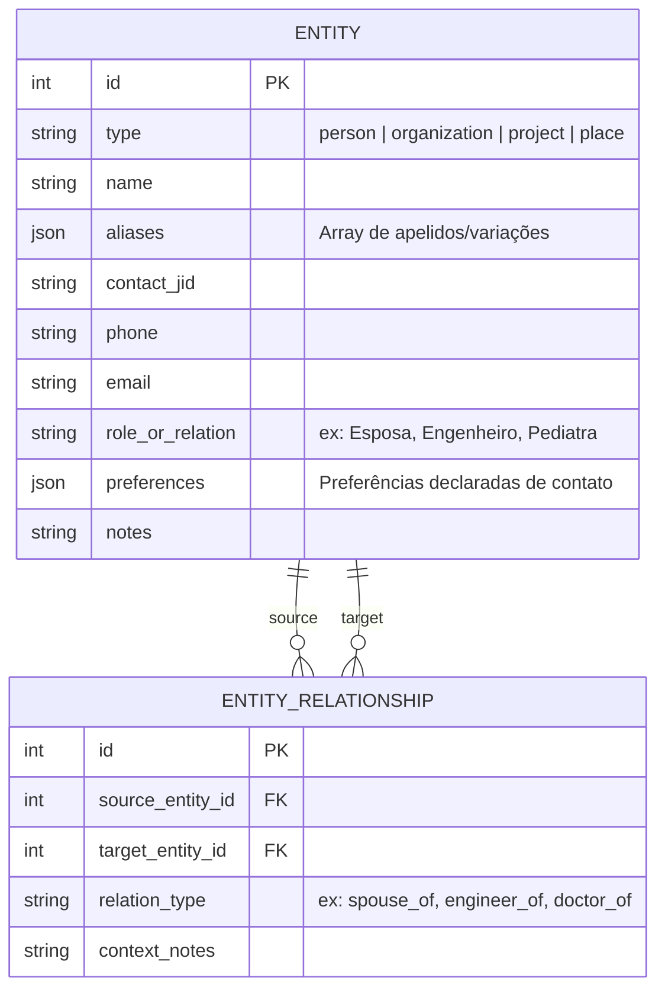
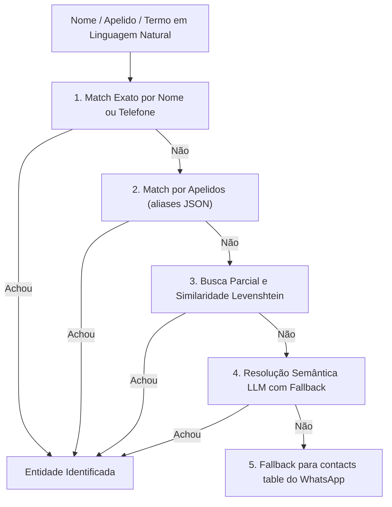

# 07. CRM Pessoal & Grafo de Entidades

O **CRM Pessoal e Grafo de Relacionamentos** estrutura todo o ecossistema relacional do Luiz: familiares, amigos, sócios, prestadores de serviço, médicos, clientes, empresas e projetos.

Os módulos centrais são [`src/memory/entities.ts`](../../src/memory/entities.ts), [`src/agents/crmAgent.ts`](../../src/agents/crmAgent.ts), [`src/services/entityResolver.ts`](../../src/services/entityResolver.ts) e [`src/utils/jidResolver.ts`](../../src/utils/jidResolver.ts).

---

## 🕸️ Modelo de Dados do Grafo

---

## 🧠 Resolução Inteligente de Entidades (`entityResolver.ts`)

Quando o Luiz menciona alguém em linguagem natural (ex: *"Avisa a Lu que estou a caminho"*, *"Qual o telefone do Dr. Marcos?"*, *"O Ricardo da reforma já respondeu?"*), o sistema faz uma resolução multi-camadas:

---

## 📇 Mapeamento e Equivalência de JIDs (`jidResolver.ts`)

O WhatsApp moderno opera com **LIDs** (ex: `106880328278246@lid`) para privacidade nas mensagens recebidas, enquanto o sistema armazena números canônicos (ex: `5519999021962@s.whatsapp.net`).

O utilitário `jidResolver.ts`:
1. **Carrega Mapeamentos em Disco:** Lê os arquivos `lid-mapping-*.json` da pasta `auth_info_baileys/`.
2. **Normalização Canônica:** Converte qualquer LID para número internacional através de `canonicalJid(jid)`.
3. **Comparação de Equivalência:** `jidsMatch(jidA, jidB)` compara se dois identificadores apontam para a mesma pessoa física, garantindo que respostas de alvos de missões acionem o contexto correto.
4. **Formatação Amigável:** A função `formatJidForUser()` converte JIDs crus em nomes legíveis (ex: `5519999021962@s.whatsapp.net` → *"Ricardo (Engenheiro da Reforma)"*).

---

## 🛠️ Ferramentas do `crmAgent`

- **`save_entity`:** Cadastra ou atualiza uma entidade com atributos de contato, cargo e preferências (ex: *"odeia chamadas de manhã, prefere áudio curto"*).
- **`add_relationship`:** Cria um vínculo direcionado entre duas entidades no grafo.
- **`get_entity_context`:** Gera o dossiê completo de uma pessoa/projeto com todas as suas conexões relacionais.
- **`search_entities`:** Busca rápida por palavra-chave ou telefone.

---

## 🔗 Próximos Passos & Documentos Relacionados

- Para entender como o CRM apoia as negociações com terceiros:  
  👉 [09. Missões Autônomas com Terceiros](09-missoes-autonomas.md)
- Para entender o motor de cobranças e follow-ups por pessoa:  
  👉 [10. Follow-Up & Cobranças](10-follow-up-e-cobrancas.md)
