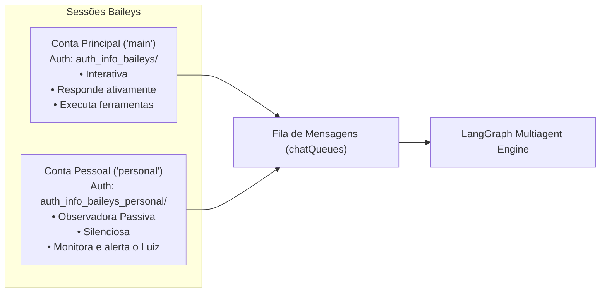

# 08. Transporte WhatsApp & Mensageria Baileys

A camada de transporte ([`src/transport/whatsapp.ts`](../../src/transport/whatsapp.ts)) conecta o runtime da Bia ao protocolo do WhatsApp através da biblioteca **Baileys** (`@whiskeysockets/baileys`).

---

## 📱 Arquitetura Multi-Contas

A Bia suporta a operação simultânea de duas contas de WhatsApp independentes:

---

## ⚡ Roteador de Comandos Imediatos (`src/commands/commandRouter.ts`)

Antes de qualquer mensagem entrar na fila do LangGraph e consumir tokens dos modelos, o transporte inspeciona o texto via `isCommand(text)`:
- **Gatilho:** Mensagens iniciando com `/` ou `!`.
- **Bypass de Zero-Latência:** Executa operações administrativas, diagnósticos e manipulações diretas de memória de forma determinística e quase instantânea (<100ms), sem passar pela Supervisora.

| Comando | Sinônimos | Finalidade & Ação Executada |
|---|---|---|
| `/novo` | `/limpar`, `/reset` | Arquiva o tópico conversacional ativo, limpa o histórico da sessão e cancela a fila pendente sem tocar na memória de longo prazo. |
| `/status` | — | Relatório técnico com tópico ativo, nível de confiança (`isTrustedChat`), status de silêncio, modelo em uso e uptime. |
| `/cancelar` | `/stop` | Interrompe imediatamente tarefas em execução e limpa as mensagens em espera na fila. |
| `/hoje` | `/agenda` | Consulta consolidada de tarefas do dia e rotinas agendadas para hoje. |
| `/tarefas` | `/pendencias` | Lista todas as tarefas pendentes na tabela `tasks` com IDs, urgência e prazos. |
| `/lembretes` | `/rotinas` | Lista lembretes únicos e rotinas recorrentes ativas na tabela `routines`. |
| `/guardar <texto>` | `/lembrar` | Insere diretamente um fato ou nota na base vetorial RAG (`addVectorMemory`). |
| `/buscar <termo>` | — | Busca semântica direta no banco vetorial SQLite (`searchVectorMemory`) retornando os 5 melhores resultados. |
| `/perfil` | `/memoria` | Retorna o snapshot atual da Memória de Trabalho Cognitiva da Bia. |
| `/consolidar` | `/sono` | Força a execução imediata da consolidação bidirecional de sono (`consolidateWorkingMemorySnapshot`). |
| `/silenciar` | `/ignorar` | Adiciona o chat atual à lista de grupos ignorados (`addIgnoredGroup`). |
| `/ativar` | — | Remove o chat da lista de ignorados, reabilitando respostas da Bia (`removeIgnoredGroup`). |
| `/segurança` | `/confiaveis` | Exibe o status administrativo do remetente e a lista de JIDs autorizados. |
| `/modelo <opcao>` | — | Permite alternar o LLM ativo para o chat atual em runtime (`flash`, `pro`, `deepseek`). |
| `/explicar` | — | Apresenta a auditoria de raciocínio e ferramentas executadas no turno imediatamente anterior. |
| `/saldo` | — | Consulta em tempo real o saldo disponível e recargas na API oficial da DeepSeek. |
| `/ajuda` | `/comandos`, `/help` | Menu interativo explicativo com todos os comandos disponíveis. |

---

## ⏱️ Fila de Mensagens com Debouncing Adaptativo

No WhatsApp, humanos costumam enviar várias mensagens curtas em sequência antes de concluir o pensamento (ex: *"Oi"*, *"Tudo bem?"*, *"Você pode ver o relatório pra mim?"*).

Para evitar que a IA dispare 3 execuções caras em paralelo, o sistema utiliza uma **fila em memória (`chatQueues`)**:

1. **Janela de Silêncio Dinâmica:** Quando uma mensagem chega, o processamento aguarda uma janela de silêncio (debounce).
2. **Bufferização e Agrupamento:** Mensagens consecutivas do mesmo remetente são agrupadas em uma única entrada consolidada.
3. **Detecção de Sobrecarga:** Se uma nova mensagem chega enquanto o modelo já está processando, ela é enfileirada e concatenada no turno seguinte com flag `wasReceivedWhileProcessing: true`.
4. **Persistência de Queda (`pendingQueue.ts`):** Todas as mensagens em buffer são salvas na tabela `pending_messages`. Caso a aplicação seja reiniciada, as mensagens pendentes são recuperadas no startup.

---

## 🎙️ Transcrição de Áudio com Whisper (Groq Cloud)

Mensagens de voz recebidas no WhatsApp são processadas automaticamente:
1. O áudio em formato `.ogg` / Opus é baixado via `downloadMediaMessage()`.
2. Enviado para a API de transcrição ultra-rápida do **OpenAI Whisper** hospedado na **Groq Cloud** (`https://api.groq.com/openai/v1`).
3. O texto transcrito substitui o áudio no fluxo do LangGraph com a anotação `[Áudio Transcrito]`, permitindo que todos os especialistas e a Supervisora operem como se fosse texto normal.

---

## 🚫 Descarte de Status/Stories & Listas de Transmissão

Para evitar o consumo desnecessário de processamento, análise visual e tokens com postagens públicas efêmeras de contatos:
- **`isBroadcastJid(chatJid)`:** Descarta imediatamente no evento `messages.upsert` e na fila de entrada qualquer mensagem com JID `status@broadcast` ou terminado em `@broadcast`.
- Mídias de Status (fotos/vídeos de Stories) não são baixadas nem analisadas pelo Gemini, mantendo o foco do runtime estritamente em conversas 1-a-1 e grupos autorizados.

---

## 👥 Descoberta de Grupos & Resolução Resiliente de Nomes

Para permitir consultas instantâneas e seguras de grupos e relatórios de resumo diário:
- **`getAllGroups(accountName, forceRefresh)`:** Consulta os grupos em que o socket participa (`groupFetchAllParticipating`) com cache em memória com TTL de 10 minutos. Caso o socket esteja desconectado ou em modo passivo, combina e enriquece a lista com os grupos registrados no histórico local em disco (`data/history/{acc}/*.json`).
- **`formatJidForUser(jid, accountName)`:** Para JIDs de grupo (`@g.us`), busca o nome amigável no cache de grupos e, caso ausente, realiza fallback consultando o atributo `chatName` nas mensagens do histórico persistido.
- **`generateDailySummaryTool`:** Opera diretamente sobre os JIDs persistidos no SQLite (`daily_summary_groups`), calculando dinamicamente uma janela de **72 horas às segundas-feiras** (para cobrir o fim de semana e o fechamento de sexta) e **24 horas nos demais dias úteis**.

---

## 🔁 Deduplicação de Saídas & Proteção contra Loops

Para garantir que a Bia nunca entre em loop infinito conversando consigo mesma ou reenviando mensagens duplicadas em caso de reconexão de socket:
- **`botSentMessageIds`:** Conjunto em memória que registra todos os IDs de mensagens emitidas pela Bia, descartando ecos do socket.
- **`recentOutboundMessages`:** Armazena o hash normalizado das últimas mensagens enviadas por chat com TTL de 60 segundos. Se o modelo tentar enviar um texto idêntico ao mesmo chat em menos de 1 minuto, o envio é bloqueado por `shouldBlockMessage()`.

---

## ⚡ Execuções Isoladas de Sistema & Rotinas Agendadas

Tarefas em segundo plano (como resumos diários, checagens de e-mail e rotinas cron) são disparadas via `injectSystemMessage()` e `executeIsolatedSystemMessage()`:
- **Fila Dedicada de Sistema (`systemExecutionQueues`):** Isola execuções de background por chat, evitando conflitos com a digitação de usuários humanos.
- **Gatilhos (`triggerType`):** Identificados como `cron_routine` ou `system_inject`.
- **Supressão de Mensagens Intermediárias:** Em execuções isoladas de sistema/cron, o método `sendIntermediateMessage()` descarta qualquer envio preliminar e a Supervisora não produz mensagens intermediárias, evitando notificações desnecessárias no WhatsApp e entregando diretamente a resposta final solicitada.

---

## 🔗 Próximos Passos & Documentos Relacionados

- Para entender o sistema de missões que usa este transporte para falar com terceiros:  
  👉 [09. Missões Autônomas com Terceiros](09-missoes-autonomas.md)
- Para entender o sentinela que monitora e-mails e notifica via WhatsApp:  
  👉 [11. Sentinela de E-mails do Gmail](11-sentinela-de-email.md)
