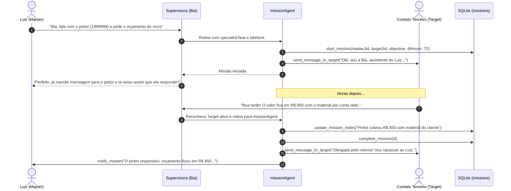

# 09. Missões Autônomas com Terceiros

O sistema de **Missões Autônomas** permite que a Bia atue como negociadora e procuradora do Luiz, conversando diretamente com contatos de terceiros (prestadores de serviço, vendedores, fornecedores) pelo WhatsApp sem que o Luiz precise intervir a cada mensagem.

Os módulos responsáveis são [`src/memory/missions.ts`](../../src/memory/missions.ts) e [`src/agents/missionAgent.ts`](../../src/agents/missionAgent.ts).

---

## 🔄 Ciclo de Vida de uma Missão



---

## 🔒 Regras de Ouro e Isolamento Comunicacional

1. **A Supervisora NÃO Fala com o Alvo Diretamente:** Quando o chat atual pertence a um `Target` de missão ativa, a Supervisora **nunca** deve formular uma resposta direta no campo `response`. Toda comunicação é realizada exclusivamente pelo `missionAgent` via ferramentas (`send_message_to_target`, `notify_master`).
2. **Proibição de `intermediateMessage` no Chat do Alvo:** A Supervisora não emite mensagens de pensamento (ex: *"Consultando..."*) para não estragar a negociação com o terceiro.
3. **Notificação Estratégica ao Criador (`notify_master`):**
   - O `missionAgent` **não** incomoda o Luiz a cada mensagem do alvo.
   - Ele acumula dados nas anotações da missão (`update_mission_notes`) e notifica o criador **apenas quando:**
     - A) A missão for finalizada com sucesso.
     - B) O terceiro fizer uma pergunta crítica que só o Luiz sabe responder.
4. **Controle de Tempo de Vida (TTL):**
   - Tarefas urgentes (ex: *"pedir almoço agora"*): `ttlHours: 4`.
   - Negociações normais: `ttlHours: 72` (padrão) a `168` (7 dias).
   - O método `expireOldMissions()` cancela missões expiradas automaticamente em segundo plano.

---

## 🗄️ Esquema da Tabela `missions`

```sql
CREATE TABLE missions (
  id INTEGER PRIMARY KEY AUTOINCREMENT,
  masterJid TEXT NOT NULL,          -- JID do criador (Luiz)
  targetJid TEXT NOT NULL,          -- JID do contato terceiro
  objective TEXT NOT NULL,          -- Objetivo da missão em linguagem natural
  status TEXT NOT NULL DEFAULT 'active', -- 'active' | 'completed' | 'cancelled'
  notes TEXT,                       -- Histórico consolidado e anotações da negociação
  createdAt DATETIME DEFAULT CURRENT_TIMESTAMP,
  updatedAt DATETIME DEFAULT CURRENT_TIMESTAMP,
  expiresAt DATETIME,               -- Data/hora de expiração baseada no TTL
  ttlHours INTEGER
);

CREATE UNIQUE INDEX idx_unique_active_mission 
ON missions(masterJid, targetJid) WHERE status = 'active';
```

---

## 🔗 Próximos Passos & Documentos Relacionados

- Para entender o motor de cobranças e follow-ups integrado:  
  👉 [10. Follow-Up & Cobranças](10-follow-up-e-cobrancas.md)
- Para entender o transporte de mensagens:  
  👉 [08. Transporte WhatsApp & Mensageria](08-transporte-whatsapp-baileys.md)
