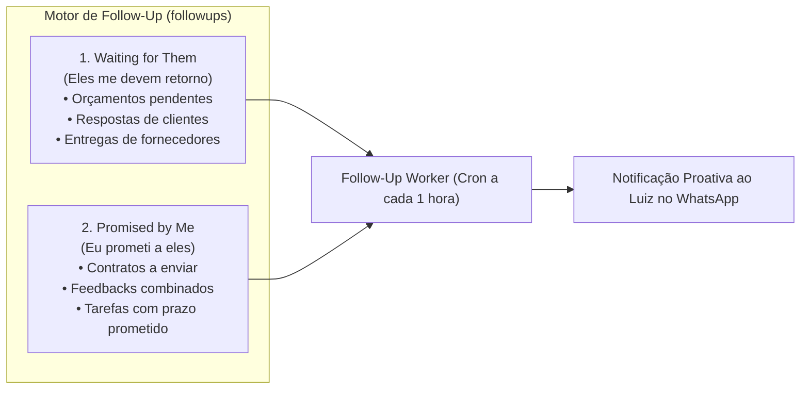

# 10. Follow-Up & Cobranças (Waiting for Them & Promised by Me)

O motor de **Follow-Up e Cobranças** ([`src/memory/followUps.ts`](../../src/memory/followUps.ts), [`src/agents/followUpAgent.ts`](../../src/agents/followUpAgent.ts) e [`src/services/followUp/followUpWorker.ts`](../../src/services/followUp/followUpWorker.ts)) gerencia pendências conversacionais em duas vias essenciais para a produtividade executiva.

---

## 🧭 As Duas Vias de Acompanhamento



---

## ⚙️ Sincronização e Auto-Resolução

1. **Criação Automática por Tarefas (`taskAgent`):**
   - Quando uma tarefa é criada com verbos como *"Enviar contrato"*, *"Mandar proposta"*, o sistema gera automaticamente uma pendência `promised_by_me`.
   - Quando uma tarefa começa com *"Cobrar retorno"*, *"Aguardar orçamento"*, gera uma pendência `waiting_for_them`.
2. **Auto-Resolução Inteligente no WhatsApp:**
   - Quando um contato que possuía uma pendência `waiting_for_them` envia uma mensagem no WhatsApp, a função `autoResolveFollowUpsForChat(chatJid)` é acionada imediatamente em background, marcando a pendência como resolvida (`status: 'resolved'`) sem necessidade de intervenção manual.
3. **Worker em Segundo Plano (`followUpWorker.ts`):**
   - Roda periodicamente via Cron (`node-cron`).
   - Identifica pendências vencidas (`dueDate < NOW()`) e emite alertas proativos ao Luiz no WhatsApp.

---

## 🗄️ Esquema da Tabela `followups`

```sql
CREATE TABLE followups (
  id INTEGER PRIMARY KEY AUTOINCREMENT,
  type TEXT NOT NULL,               -- 'waiting_for_them' | 'promised_by_me'
  contactName TEXT NOT NULL,        -- Nome amigável do contato
  contactJid TEXT,                  -- JID do WhatsApp (opcional)
  description TEXT NOT NULL,        -- Descrição da pendência
  dueDate DATETIME,                 -- Prazo limite estipulado
  status TEXT NOT NULL DEFAULT 'pending', -- 'pending' | 'resolved' | 'cancelled' | 'overdue'
  contextOrigin TEXT NOT NULL DEFAULT 'direct', -- 'direct' | 'chat_jid' | 'mission_id' | 'passive_observer'
  chatJid TEXT,
  missionId INTEGER,
  lastNotifiedAt DATETIME,
  notes TEXT,
  createdAt DATETIME DEFAULT CURRENT_TIMESTAMP,
  updatedAt DATETIME DEFAULT CURRENT_TIMESTAMP
);

CREATE INDEX idx_followups_status_type ON followups(status, type);
CREATE INDEX idx_followups_contact_jid ON followups(contactJid);
```

---

## 🔗 Próximos Passos & Documentos Relacionados

- Para entender o sentinela de e-mails que complementa o monitoramento:  
  👉 [11. Sentinela de E-mails do Gmail](11-sentinela-de-email.md)
- Para entender o CRM e dados de contatos:  
  👉 [07. CRM Pessoal & Grafo de Entidades](07-crm-e-grafo-de-entidades.md)
