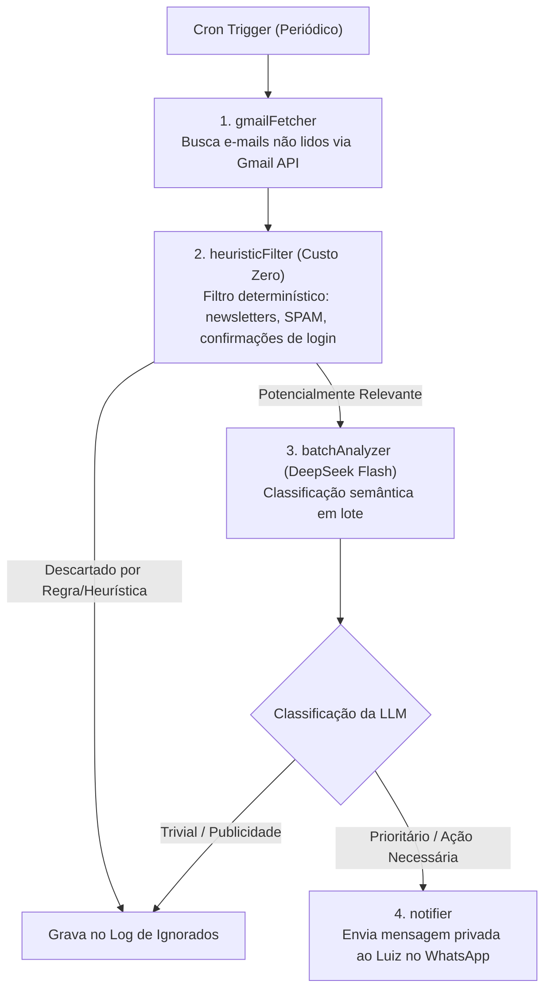

# 11. Sentinela de E-mails do Gmail (Inbox Watcher)

O **Sentinela de E-mails** ([`src/services/emailSentinel/`](../../src/services/emailSentinel/) e [`src/agents/emailSentinelAgent.ts`](../../src/agents/emailSentinelAgent.ts)) é um serviço autônomo que monitora a caixa de entrada do Gmail do Luiz em background, filtrando ruído e alertando imediatamente no WhatsApp sobre e-mails prioritários ou urgentes.

---

## 🏗️ Arquitetura em Pipeline

---

## 🎯 Regras Dinâmicas do Sentinela (Ensinadas pelo Usuário)

O Luiz pode ensinar regras de filtragem diretamente pelo WhatsApp conversando com a Bia:
- *"Nunca mais me avise de e-mails da Loja X"* → `add_sentinel_rule(type: 'ignore', pattern: 'Loja X')`.
- *"E-mails da escola dos meus filhos ou do condomínio são sempre prioridade"* → `add_sentinel_rule(type: 'priority', pattern: 'Escola|Condomínio')`.

### Tabelas SQLite do Sentinela:
- `email_sentinel_rules`: Armazena regras de `ignore` e `priority` com padrões regex ou palavras-chave.
- `email_sentinel_logs`: Histórico de todos os e-mails varridos, informando se foram alertados ou descartados e o motivo da decisão.

---

## 🔗 Próximos Passos & Documentos Relacionados

- Para entender o sistema de avaliação de qualidade e guardrails:  
  👉 [12. Avaliação de Qualidade & Segurança](12-avaliacao-qualidade-e-seguranca.md)
- Para entender as ferramentas de Workspace MCP:  
  👉 [05. Agentes Especialistas](05-agentes-especialistas.md)
