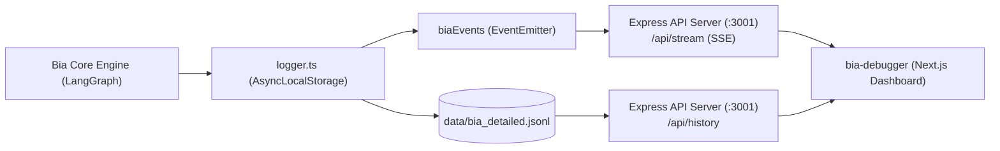

# 14. Observabilidade, API Express & Bia Debugger

A Bia possui uma infraestrutura completa de observabilidade para permitir auditoria em tempo real, inspeção visual dos nós do LangGraph e monitoramento de custos de LLM.

---

## 📊 Pipeline de Observabilidade

---

## 📝 Logging Estruturado (`src/utils/logger.ts`)

- **Contexto Assíncrono (`AsyncLocalStorage`):** Cada mensagem recebida gera um `triggerId` único. Todas as chamadas de logs subsequentes (Supervisora, especialistas, avaliador, ferramentas) herdam automaticamente esse `triggerId`, permitindo rastrear o fluxo ponta a ponta sem poluir os argumentos das funções.
- **Formato JSONL:** Todos os eventos são gravados em `data/bia_detailed.jsonl` com timestamps ISO, payloads de entrada/saída, contagem de tokens e métricas de tempo de resposta.
- **Política de Retenção (14 dias):** O módulo `src/utils/maintenance.ts` higieniza diariamente o arquivo `bia_detailed.jsonl`, mantendo apenas os últimos 14 dias para manter a leitura da API rápida e evitar consumo excessivo de disco e memória.

---

## 🌐 API Server Express (`src/api/server.ts`)

Iniciado automaticamente no bootstrap da aplicação na porta **3001**:
- **`GET /api/history`:** Lê e transmite via stream as últimas linhas do arquivo `bia_detailed.jsonl` sem estourar a memória do Node.js.
- **`GET /api/stream`:** Endpoint **Server-Sent Events (SSE)** que transmite os logs e decisões dos agentes em tempo real para a interface gráfica.

---

## 🖥️ Painel Visual `bia-debugger`

Aplicação web desenvolvida em **Next.js** localizada na pasta `bia-debugger/`:
- **Painel de Conversas:** Lista conversas ativas por chat/contato.
- **Painel de Traces:** Visualização em linha do tempo dos nós executados pelo LangGraph.
- **Painel Inspector:** Inspeção profunda dos payloads de entrada/saída das ferramentas, tokens consumidos e vereditos do `evaluator`.

---

## 🔭 Tracing com LangSmith

O runtime da Bia possui instrumentação nativa para **LangSmith Tracing** através das variáveis de ambiente:
- `LANGSMITH_TRACING=true` ou `LANGCHAIN_TRACING_V2=true`
- `LANGSMITH_PROJECT` ou `LANGCHAIN_PROJECT` (padrão: `'default'`)
- `LANGSMITH_API_KEY`: Chave da plataforma LangSmith.

Quando ativado, cada passo do grafo LangGraph, chamadas LLM e invocações de ferramentas são automaticamente transmitidas para a plataforma LangSmith para análise aprofundada de latência, consumo de tokens e debugging distribuído.

---

## 🔗 Próximos Passos & Documentos Relacionados

- Para consultar o guia prático de desenvolvimento e testes:  
  👉 [15. Guia de Evolução & Manutenção](15-guia-de-evolucao-e-manutencao.md)
