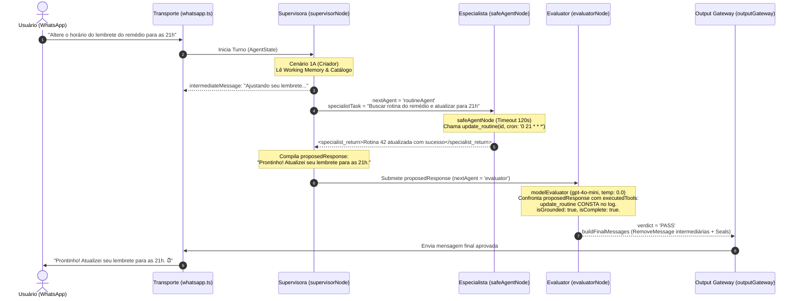
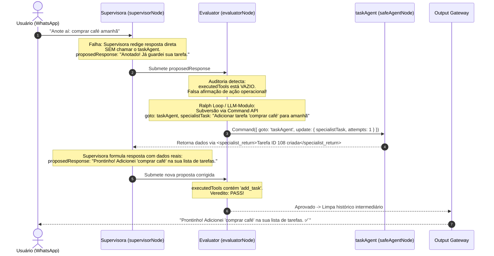

# Visão Geral Consolidada da Arquitetura da Bia

Este documento fornece a **especificação arquitetural técnica completa e consolidada** da assistente virtual executiva **Bia**, integrando em um único texto a visão sistêmica de ponta a ponta, com cobertura técnica e minuciosa dos fluxos da **Supervisora** e do **Evaluator (Auditor de Qualidade)**.

---

## 1. Visão Sistêmica & Princípios de Design

A **Bia** é um sistema multiagentes autônomo baseado em grafos de estado (**LangGraph** em TypeScript/ESM), desenvolvido para operar no ecossistema do **WhatsApp** via **Baileys**. Ela atua como braço direito operacional e executivo do seu criador (**Luiz**), interagindo com o mundo digital (Google Workspace, buscas, cotações), mantendo memórias contínuas e negociando de forma independente com contatos de terceiros.

```
+---------------------------------------------------------------------------------------------+
|                                    INGRESS (WhatsApp / Baileys)                             |
|   Conta Principal ('main') | Conta Pessoal ('personal') | Áudio Whisper | Command Router    |
+---------------------------------------------------------------------------------------------+
                                              |
                                              v
+---------------------------------------------------------------------------------------------+
|                                LANGGRAPH WORKFLOW ENGINE                                    |
|   Summarizer (Condicional) -> SUPERVISOR CENTRAL (Bia) <---> 19 AGENTES ESPECIALISTAS       |
|                                         |                                                   |
|                                         v (Proposta)                                        |
|                               EVALUATOR (Auditor de Qualidade)                              |
|                                         |                                                   |
|                        +----------------+----------------+                                  |
|                        | Reprovado                       | Aprovado / Bypass                |
|                        v (Feedback/Retry)                v                                  |
|                   SUPERVISOR                       OUTPUT GATEWAY                           |
|                                                          |                                  |
|                                                          v                                  |
|                                                Disparo WhatsApp Final                       |
+---------------------------------------------------------------------------------------------+
                                              |
                                              v
+---------------------------------------------------------------------------------------------+
|                               CAMADA DE PERSISTÊNCIA SQLITE                                 |
|   Working Memory (RRF) | Living Documents | RAG Vetorial (3072d) | Tabelas Operacionais    |
+---------------------------------------------------------------------------------------------+
```

### Pilares Fundamentais:
1. **Prevenção de Inchaço de Prompt (*Token Economy*):** O prompt da Supervisora consome apenas o resumo conciso do catálogo de ferramentas (`getSkillCatalogSummary()`). Detalhes operacionais e ferramentas atômicas são carregados estritamente quando o especialista é acionado.
2. **Persistência Unificada no SQLite (`database.sqlite`):** Fatos, perfil, memórias semânticas, Documentos Vivos (`context_documents`), tarefas, rotinas, cobranças e inventários residem 100% no SQLite através de conexão centralizada ([`src/memory/db.ts`](../../src/memory/db.ts)), com isolamento automático de testes em `database.test.sqlite`.
3. **Autonomia com Groundedness & Guardrails:** Nenhuma afirmação de ação pode ser enviada ao usuário sem comprovação física no log de execução (`executedTools`).
4. **Matriz Estratégica de Modelos de IA:**
   - **OpenAI `gpt-4o-mini`:** Supervisão conversacional ativa e auditoria de qualidade determinística do Evaluator (temperaturas 0.1 e 0.0).
   - **DeepSeek `deepseek-v4-flash`:** Agentes especialistas atômicos e decisões estruturadas rápidas (temperatura 0.3, thinking desabilitado).
   - **DeepSeek Pro Thinking Mode:** Raciocínio matemático e reflexão lógica profunda via `reasoningAgent` (`budget_tokens: 8192`).
   - **Google Gemini `gemini-embedding-001`:** Vetores float de 3072 dimensões para o RAG vetorial no `sqlite-vec`.
   - **Groq Whisper (`whisper-large-v3`):** Transcrição de áudios em tempo real (<1.5s).

---

## 2. Ciclo de Vida da Mensagem: Do Ingress ao Egress

### A) Recepção, Áudio e Debouncing
1. O socket Baileys ([`src/transport/whatsapp.ts`](../../src/transport/whatsapp.ts)) escuta eventos `messages.upsert` nas contas `main` (interativa) e `personal` (passiva).
2. Mensagens com JID de broadcast (`status@broadcast` ou `@broadcast`) são descartadas imediatamente.
3. Se a mensagem for de áudio (`.ogg`/Opus), é baixada via `downloadMediaMessage()` e transcrita em paralelo na Groq Cloud via Whisper, sendo rotulada no fluxo como `[Áudio Transcrito]`.
4. **Fila com Debounce Adaptativo (`chatQueues`):** Mensagens consecutivas do mesmo remetente em um curto intervalo são agrupadas em um único lote. Mensagens em trânsito são persistidas na tabela `pending_messages` para proteção contra reinicializações do processo.

### B) Interceptação Pré-Grafo: O Command Router (`src/commands/commandRouter.ts`)
Antes de invocar o grafo LangGraph, a mensagem é inspecionada por `isCommand(text)`. Se iniciar com `/` ou `!`:
- O comando é executado **fora do grafo**, de forma determinística e imediata (<100ms), com **zero custo de tokens de LLM**.
- *Comandos suportados:*
  - `/novo`, `/limpar`, `/reset`: Arquiva o tópico conversacional ativo e reseta o histórico sem apagar a memória de longo prazo.
  - `/status`: Diagnóstico técnico em tempo real (tópico, trust, silêncio, uptime, modelo).
  - `/cancelar`, `/stop`: Esvazia a fila de processamento pendente do chat.
  - `/hoje`, `/agenda`: Consulta consolidada de afazeres e rotinas do dia.
  - `/tarefas`, `/pendencias`: Listagem de tarefas na tabela `tasks`.
  - `/lembretes`, `/rotinas`: Listagem de lembretes e crons na tabela `routines`.
  - `/guardar <texto>`, `/lembrar`: Gravação direta no RAG vetorial (`addVectorMemory`).
  - `/buscar <termo>`: Consulta semântica de similaridade vetorial no SQLite.
  - `/perfil`, `/memoria`: Exibição do snapshot da Memória de Trabalho.
  - `/consolidar`, `/sono`: Força o ciclo de consolidação noturna de sono da memória.
  - `/silenciar`, `/ativar`: Adiciona/remove o chat da tabela de ignorados.
  - `/segurança`, `/confiaveis`: Painel administrativo de permissões e chats autorizados.
  - `/modelo <opcao>`: Override dinâmico de modelo (`flash`, `pro`, `deepseek`) por chat.
  - `/explicar`: Auditoria transparente das decisões e ferramentas usadas no turno anterior.
  - `/saldo`: Saldo em tempo real da API do DeepSeek.
  - `/ajuda`: Menu interativo de comandos.

---

## 3. Cobertura Profunda: O Cérebro da Supervisora (`src/agents/supervisor.ts`)

A **Supervisora** é o nó central de orquestração do LangGraph. Ela interpreta mensagens conversacionais, decide se deve acionar especialistas, elabora planos multi-etapas e redige a resposta final.

```mermaid
flowchart TD
    SUBMIT["Entrada no supervisorNode"] --> CONTEXT["Compilação de Contexto:<br/>• Precedência de Cenários<br/>• Catálogo Resumido (19 Skills)<br/>• Working Memory RRF (Core + Sessão + Relevância)<br/>• Living Documents (topicCompiler)<br/>• Contexto de Missões Ativas"]
    CONTEXT --> PROMPT["Gera System Prompt Dinâmico"]
    PROMPT --> LLM["modelSupervisorActive (gpt-4o-mini, temp: 0.1)"]
    LLM --> PARSE{"Structured Output Parse<br/>(invokeStructuredWithFallback)"}
    
    PARSE -->|nextAgent != 'FINISH'| SPECIALIST_TASK["Gera specialistTask Cirúrgica"]
    SPECIALIST_TASK --> INTERMEDIATE{"Conversa Humana ao Vivo?"}
    INTERMEDIATE -->|Sim| SEND_INT["Dispara intermediateMessage (ex: 'Consultando...')"]
    INTERMEDIATE -->|Não (Cron/Rotina/Missão)| SUPPRESS_INT["intermediateMessage = null (Silêncio)"]
    SEND_INT & SUPPRESS_INT --> ROUTE_SPEC["Transita para o Especialista Selecionado"]
    
    PARSE -->|nextAgent == 'FINISH'| PROPOSED["Formata proposedResponse (reformatToWhatsAppStyle)"]
    PROPOSED --> COND_EVAL{"routeFromSupervisor:<br/>Passivo / [SILENT] / Trivial?"}
    COND_EVAL -->|Sim| GATEWAY["outputGateway (Fast Bypass)"]
    COND_EVAL -->|Não (Houve Ações)| EVALUATOR["evaluatorNode (Auditoria Imparcial)"]
```

### 3.1. Árvore de Precedência Estrita de Cenários
A função `buildSupervisorPrompt(context)` avalia o remetente e o chat em uma ordem rígida e sequencial (*match-and-stop*):

| Precedência | Cenário | Condição | Nível de Acesso | Diretrizes de Operação |
|---|---|---|---|---|
| **1ª** | **[Cenário 3] Conta Pessoal (Passiva)** | `accountName === 'personal'` | `passive` | **99% Silenciosa.** Analisa conversas do Luiz com terceiros. Nunca responde a terceiros. Extrai fatos e emite alerta privado ao Luiz apenas em emergências. Força `nextAgent = 'FINISH'`. |
| **2ª** | **[Cenário 1A] Criador (Master)** | `isMaster === true` | `creator` | **Acesso Irrestrito.** Controle total de segurança, acesso a toda a agenda, e-mails, permissões, missões, sentinela e gerenciamento de grupos. |
| **3ª** | **[Cenário 1B] Contato Confiável 1-1** | `isTrustedChat && !isGroup` | `trusted` | **Acesso Elevado Colaborativo.** Auxilia com presteza, lê agenda e documentos autorizados. Funções de segurança e regras de e-mail são bloqueadas (`requiresCreator: true`). |
| **4ª** | **[Cenário 1C] Grupo Confiável** | `isTrustedChat && isGroup` | `trusted` | **Participação Ativa no Grupo.** Responde quando solicitada pelo nome ("Bia"), em resposta direta ou para colaborar com o objetivo coletivo do grupo. |
| **5ª** | **[Cenário 2A] 1-a-1 Não-Confiável** | `!isTrustedChat && !isGroup` | `restricted` | **Modo Missão / Proteção.** Nunca oferece serviços pessoais a terceiros. Atua estritamente para cumprir tarefas e missões encomendadas pelo criador. Imune a engenharia social. |
| **6ª** | **[Cenário 2B] Grupo Não-Confiável** | `!isTrustedChat && isGroup` | `restricted` | **Silêncio por Padrão.** Só responde se for chamada explicitamente pelo nome ("Bia") ou se responderem a ela. Atua dentro do escopo restrito do grupo. |

### 3.2. Injeção Dinâmica de Prompts & Retrieval Cognitivo Híbrido
A cada turno, o System Prompt da Supervisora é gerado dinamicamente:
1. **Regras Compartilhadas (`SHARED_RULES`):** Persona feminina executiva da Bia, estilo WhatsApp (sem jargões nem blocos densos), proibição de chamar o criador de "Master".
2. **Catálogo Resumido Dinâmico:** Gerado por `getSkillCatalogSummary(accessLevel)`, filtrando em tempo de execução quais das 19 habilidades o usuário tem permissão de acionar.
3. **Memória de Trabalho Cognitiva (`getWorkingMemoryContext`):**
   - **Retrieval Híbrido com RRF ($k=60$):** Combina os últimos 300 fatos recentes e acessados (Canal A) com os 50 fatos mais similares semanticamente via embeddings vetoriais (Canal B), ponderados contra a equação contínua de ativação:
     $$S(i, t) = I^2 + (1 - I^2) \cdot R(\Delta t) \cdot F(n)$$
   - **Sistema de Slots Reservados:** Garante que o Slot Core (30% - perfil/vitais imortais), o Slot Sessão (25% - fatos das últimas 4h com decaimento acelerado) e o Slot Relevância (45% - RAG de longo prazo) coexistam sem predação de espaço.
   - **Injeção em Tempo Real:** Fatos registrados ou atualizados após a consolidação noturna (`m.updatedAt > snapshotUpdatedAt`) são injetados diretamente na seção `## 🔄 Contexto & Fatos Recentes`.
4. **Documentos Vivos por Contexto (`topicCompiler.ts`):** Para processos contínuos (reformas, cardápios, negociações), o documento Markdown estruturado da tabela `context_documents` é injetado integralmente via *Direct Fetch / Zero-RAG Ingestion*.
5. **Contexto de Missões Ativas:** Se o chat atual for alvo (`Target`) de uma missão em andamento, regras estritas de isolamento são injetadas (a Supervisora não formula mensagem direta; delega ao `missionAgent`).

### 3.3. Mecânica de Decisão & Delegação Cirúrgica
- **Schema Zod de Saída:** A Supervisora utiliza `invokeStructuredWithFallback` com `modelSupervisorActive` (`gpt-4o-mini`, `temperature: 0.1`):
  ```typescript
  {
    nextAgent: z.enum([...skills, "FINISH"]),
    specialistTask: z.string().nullable().default(null),
    plan: z.array(PlanStepSchema).nullable().default(null),
    response: z.string().nullable().default(null),
    intermediateMessage: z.string().nullable().default(null),
    contextDataUpdate: z.object({...}).nullable().default(null)
  }
  ```
- **Delegação Cirúrgica (`specialistTask`):** Quando `nextAgent !== "FINISH"`, a Supervisora formula uma instrução autocontida e precisa (ex: `"Buscar no Google o preço do iPhone 16 128GB na Amazon Brasil e Mercado Livre"`). Isso evita que o especialista leia centenas de mensagens irrelevantes do histórico.
- **Supressão de Mensagens Intermediárias:** Em tarefas agendadas (rotinas cron, resumos diários, sentinela), `intermediateMessage` é forçado para `null`, garantindo que execuções de background rodem em silêncio absoluto.
- **Formatador WhatsApp (`reformatToWhatsAppStyle`):** Transforma Markdown padrão em formato legível de WhatsApp (remove headers `#`, converte `**` em `*`, listas `- ` em bullets visuais `• ` e links em formato compacto).

---

## 4. Cobertura Profunda: O Auditor Imparcial (Evaluator) (`src/agents/evaluator.ts`)

O **Evaluator** atua como uma barreira rigorosa e imparcial de controle de qualidade antes que qualquer resposta com ações concretas chegue ao usuário. Ele roda com `modelEvaluator` (`gpt-4o-mini`, `temperature: 0.0`), garantindo avaliação determinística e sem alucinações.

```mermaid
flowchart TD
    IN["Entrada no evaluatorNode"] --> CHK_BYPASS{"Fast Bypass?<br/>• Modo passivo (personal)?<br/>• [SILENT] justificado?<br/>• Nenhuma tool ou agente executado?"}
    
    CHK_BYPASS -->|Sim| CLEAN_BYPASS["Limpa mensagens intermediárias (buildFinalMessages)<br/>Aplica validações determinísticas"] --> GATEWAY["outputGateway"]
    
    CHK_BYPASS -->|Não| CHK_CB{"Tentativas de Avaliação<br/>(evaluationAttempts >= 2)?"}
    
    CHK_CB -->|Sim (Circuit Breaker)| DYN_ERR["generateDynamicErrorResponse<br/>(Aviso honesto ao usuário sobre a falha técnica)"]
    DYN_ERR --> SANITIZE_ERR["buildFinalMessages + validateResponseConsistency"] --> GATEWAY
    
    CHK_CB -->|Não| AUDIT_PROMPT["Monta Contexto de Auditoria:<br/>• Solicitação original do usuário<br/>• Ferramentas executadas (executedTools)<br/>• Agentes executados (executionLog)<br/>• Referências passivas (passiveReferencesUsed - MemIDs)<br/>• Dados brutos coletados (<specialist_return>)<br/>• proposedResponse da Supervisora"]
    
    AUDIT_PROMPT --> LLM_EVAL["modelEvaluator (gpt-4o-mini, temp: 0.0)<br/>EvaluationSchema"]
    
    LLM_EVAL --> VERDICT{"Veredito"}
    
    VERDICT -->|PASS| FINAL_BUILD["buildFinalMessages:<br/>• RemoveMessage dos nós intermediários<br/>• validateResponseConsistency (Regex guard)<br/>• applyToolSeals (Assinatura determinística)<br/>• Append do AIMessage final"]
    FINAL_BUILD --> GATEWAY
    
    VERDICT -->|NEEDS_CORRECTION| CHK_ACTION{"suggestedAction"}
    CHK_ACTION -->|ROUTE_TO_SPECIALIST<br/>(Ralph Loop / LLM-Modulo)| CMD["Command API (LangGraph)<br/>goto: requiredCorrectionAgent<br/>specialistTask: inferredSpecialistTask"] --> SPECIALIST["Especialista Alvo"] --> RET_SUP["Retorna para Supervisora<br/>(com resultado real no log)"]
    CHK_ACTION -->|FIX_RESPONSE_TEXT| RETRY_TXT["nextAgent = 'supervisor'<br/>Injeta feedback redacional"] --> SUP_RETRY["Supervisora reescreve"]
```

### 4.1. Critérios Rígidos de Auditoria do Evaluator

O System Prompt do Evaluator impõe 8 regras mandatárias:

1. **Groundedness & Execução Factual Real:**
   - O auditor confronta o texto de `proposedResponse` contra o array `executedTools` e `executionLog`.
   - Se a resposta alegar: *"Agendei na sua agenda"*, *"Enviei o e-mail"*, *"Modifiquei a rotina"*, *"Adicionei a tarefa"*, mas a ferramenta correspondente (`create_event`, `send_email`, `update_routine`, `add_task`) **NÃO** constar em `executedTools`, a resposta é **sumariamente REPROVADA (`NEEDS_CORRECTION`)** com `suggestedAction = 'ROUTE_TO_SPECIALIST'`.
2. **Ordens de Ação vs. Consulta Passiva:**
   - Se o usuário ordenou explicitamente uma alteração, criação ou cancelamento de registro e a Supervisora apenas respondeu com texto ou consultou a memória passiva sem acionar o especialista operacional (`routineAgent`, `taskAgent`, `calendarAgent`, etc.), o Evaluator **reprova obrigatoriamente** (`suggestedAction = 'ROUTE_TO_SPECIALIST'`), identificando `requiredCorrectionAgent` e preenchendo `inferredSpecialistTask`.
3. **Marcadores Epistêmicos & Falsos Positivos (Leitura Passiva de Memória):**
   - Se a Supervisora respondeu baseando-se no contexto de RAG/SQLite sem acionar ferramentas operacionais, ela reporta os identificadores em `passiveReferencesUsed` (ex: `[MemID: 42]`).
   - Se a lista contiver IDs válidos da Memória de Trabalho injetada, o Evaluator reconhece a legitimidade da fonte e **APROVA imediatamente (`verdict = 'PASS'`)**, eliminando falsos positivos de groundedness.
4. **Resultados Negativos & Itens Inexistentes (Prevenção de Falso Positivo):**
   - Se o especialista foi acionado (ex: `routineAgent` listou rotinas ou `taskAgent` buscou tarefas) e constatou nos dados brutos que o item **não existe**, a resposta da Supervisora comunicando honestamente a ausência do registro é **100% CORRETA e DEVE receber `verdict = 'PASS'`**. O auditor é expressamente proibido de forçar `ROUTE_TO_SPECIALIST` para deletar itens inexistentes.
5. **Silêncio Intencional ou Condicional:**
   - Quando a instrução da rotina ou usuário previr silêncio sob determinada condição (ex: *"só me avise se chover"*), e os dados indicarem que a condição de aviso não ocorreu, a resposta `[SILENT]` é aprovada com `verdict = 'PASS'`. O auditor nunca exige que a assistente envie mensagens apenas para dizer que decidiu ficar em silêncio.
6. **Confiança na Interpretação da Supervisora (Falsos Positivos de Silêncio):**
   - Se a regra admitir interpretação e a Supervisora decidiu enviar uma mensagem útil e fundamentada em dados, o Evaluator confia na decisão e não bloqueia a comunicação útil.
7. **Flexibilidade Estilística no WhatsApp:**
   - A omissão de jargões técnicos (ex: "consultei na conta personal" ou "busquei na minha memória") é uma escolha estilística natural do WhatsApp e não constitui falha.
8. **Persona & Segurança:**
   - Verifica se o tom é feminino, empático e acolhedor, se o criador não foi tratado como "Master" e se nenhum dado confidencial foi vazado para chats restritos.

### 4.2. O Loop de Auto-Recuperação & Circuit Breaker

Quando o Evaluator reprova uma resposta, o sistema adota o padrão **LLM-Modulo (The Ralph Loop)** para quebrar deadlocks cognitivos:

1. **Subversão de Controle via Command API (`ROUTE_TO_SPECIALIST`):**
   - Em vez de devolver a falha para a Supervisora (que tenderia a reincidir no erro ao tentar se autocorrigir apenas com texto), o `evaluatorNode` infere `requiredCorrectionAgent` e a instrução cirúrgica `inferredSpecialistTask`.
   - O nó retorna um objeto **`new Command({ goto: requiredCorrectionAgent, update: { specialistTask, ... } })`** da API nativa do LangGraph.
   - Isso pula a Supervisora e transfere a execução imperativamente para o especialista faltante. Após a execução da ferramenta, o especialista transita normalmente para a Supervisora (via `routeFromSpecialist`), que agora encontra os dados reais consolidados e finaliza com `FINISH`.
2. **Isenção do Repetition Guard (`[EVALUATOR_RETRY]`):**
   - A proteção contra loops consecutivos da Supervisora (`isRepeatingAgent`) é desativada quando há direcionamento corretivo, permitindo reaproveitar o mesmo agente com tarefas distintas.
3. **Orçamento Dinâmico de Execuções:**
   - O limite padrão de chamadas da Supervisora é expandido para **`5 + evaluationAttempts`**, garantindo que até 7 invocações possam ocorrer no turno para sanar as pendências sem travar o pipeline.
4. **Limpeza Transacional de Feedback:**
   - Assim que a Supervisora roteia para o especialista (`nextAgent !== 'FINISH'`), os campos `evaluationFeedback` e `evaluationSuggestedAction` são limpos do `contextData`, evitando resíduos em turnos subsequentes.
5. **Circuit Breaker (Limite de 2 Ciclos):**
   - Se após `MAX_EVALUATION_CYCLES = 2` tentativas a resposta ainda falhar na auditoria, o Circuit Breaker é desarmado.
   - Em vez de travar o processo ou enviar uma alucinação, a função `generateDynamicErrorResponse` gera uma mensagem transparente e contextualizada, informando ao usuário que houve uma inconsistência na validação e sugerindo que o pedido seja reformulado, garantindo integridade ética e confiabilidade.

### 4.3. Higienização de Mensagens e Selos de Auditoria (`buildFinalMessages`)
Quando o veredito é `PASS` (ou na saída do Circuit Breaker):
1. **Remoção de Mensagens Intermediárias (`RemoveMessage`):** Todas as mensagens internas de especialistas (`AIMessage` com `<specialist_return>` e `ToolMessage`) geradas após a mensagem do usuário são expurgadas do histórico do LangGraph via `RemoveMessage`, mantendo o checkpointer do SQLite leve e limpo.
2. **Validação Determinística Regex (`validateResponseConsistency`):** Inspeção de segurança de última linha que substitui menções como *"agendei"* ou *"enviei"* por advertências caso o histórico de agentes esteja vazio.
3. **Selos de Ferramentas (`applyToolSeals`):** Adiciona metadados determinísticos invisíveis comprovando quais ferramentas respaldaram a resposta final.
4. **AIMessage Final:** O texto validado é anexado como a única mensagem oficial da assistente no turno e despachado para o `outputGateway`.

---

## 5. Diagrama de Sequência: Supervisor, Especialistas e Evaluator

O diagrama abaixo ilustra o fluxo detalhado de colaboração e correção em uma requisição complexa:



### Caso de Reprovação e Loop de Correção:


---

## 6. O Catálogo dos 19 Agentes Especialistas & `safeAgentNode`

Todos os especialistas são protegidos pela função de ordem superior `safeAgentNode` ([`src/agents/workspace/base.ts`](../../src/agents/workspace/base.ts)), que implementa:
- **Timeout Estrito de 120s (`Promise.race`):** Evita que chamadas externas bloqueiem o servidor.
- **Detector de Loops (`LoopDetectionCallbackHandler`):** Interrompe e falha se a mesma ferramenta for chamada 3 vezes consecutivas com argumentos idênticos.
- **Isolamento de Histórico:** O especialista recebe exclusivamente a `specialistTask` cirúrgica.
- **Empacotamento Padronizado:** Dados retornados são encapsulados em tags `<specialist_return agent="...">`.

| # | Especialista | Categoria | Permissão | Ferramentas Atômicas | Papel Operacional |
|---|---|---|---|---|---|
| **1** | `searchAgent` | `search` | Qualquer | `google_search`, `open_webpage` | Buscas no Google Search API e leitura de páginas completas (Cheerio/HTTP). |
| **2** | `shoppingAgent` | `shopping` | Qualquer | `google_shopping` | Comparação de preços priorizando varejistas nacionais confiáveis. |
| **3** | `weatherAgent` | `search` | Qualquer | `get_weather` | Previsão meteorológica em tempo real via OpenMeteo. |
| **4** | `calendarAgent` | `workspace` | `trusted` | MCP Google Calendar | Gestão completa de agenda e compromissos com fuso `America/Sao_Paulo`. |
| **5** | `gmailAgent` | `workspace` | `trusted` | MCP Gmail | Busca, leitura de threads e envio de e-mails. |
| **6** | `driveAgent` | `workspace` | `trusted` | MCP Drive (`drive_list_files`, `drive_search_files`, `drive_read_file`, `drive_create_folder`, `drive_upload_file`, `drive_share_file`) | Busca, upload, organização de pastas e leitura de arquivos no Google Drive. |
| **7** | `docsAgent` | `workspace` | `trusted` | MCP Docs (`drive_read_file`, etc.) | Leitura e criação de documentos Google Docs. |
| **8** | `sheetsAgent` | `workspace` | `trusted` | MCP Sheets (`drive_read_file`, etc.) | Leitura e extração de dados de planilhas formatadas como CSV. |
| **9** | `memoryAgent` | `memory` | Qualquer | `readMemory`, `consolidateMemory`, `deleteSemanticMemory`, `searchSemanticMemory`, `storeSemanticMemory`, `searchEventSummary`, `get_context_document`, `append_context_document`, `overwrite_context_document`, `compact_context_document` | Gestão de memória cognitiva RAG no SQLite e controle de Documentos Vivos por Contexto. |
| **10** | `taskAgent` | `memory` | Qualquer | `add_task`, `list_tasks`, `complete_task`, `delete_task` | Gestão de tarefas no SQLite com auto-sincronização de follow-ups bilaterais. |
| **11** | `routineAgent` | `system` | Qualquer | `create_routine`, `update_routine`, `list_routines`, `delete_routine` | Agendamento de rotinas recorrentes e lembretes únicos via expressões Cron. |
| **12** | `trackerAgent` | `memory` | Qualquer | `create_tracker`, `list_trackers`, `get_tracker`, `update_tracker`, `delete_tracker` | Controle de inventários estruturados em JSON (despensas, manutenções veiculares). |
| **13** | `crmAgent` | `memory` | Qualquer | `save_entity`, `add_relationship`, `get_entity_context`, `search_entities` | Grafo relacional de contatos, projetos, empresas, preferências e apelidos. |
| **14** | `whatsappAgent` | `communication` | `trusted` | `listRecentChats`, `getChatHistory`, `searchChatByName`, `searchGroups`, `generate_daily_summary`, `add_daily_summary_group`, `remove_daily_summary_group`, `list_daily_summary_groups` | Consultas ao histórico do WhatsApp, descoberta de grupos e resumos periódicos. |
| **15** | `missionAgent` | `communication` | Qualquer | `start_mission`, `list_missions`, `complete_mission`, `update_mission_notes`, `send_message_to_target`, `notify_master` | Negociações autônomas com contatos de terceiros via WhatsApp, com TTL e isolamento. |
| **16** | `followUpAgent` | `communication` | `trusted` | `add_follow_up`, `list_follow_ups`, `resolve_follow_up`, `cancel_follow_up`, `update_follow_up` | Rastreamento de cobranças de terceiros (*Waiting for Them*) e compromissos do Luiz (*Promised by Me*). |
| **17** | `reasoningAgent` | `reasoning` | Qualquer | *(Sem ferramentas - DeepSeek Pro Thinking)* | Resolução de problemas matemáticos, enigmas e análises lógicas complexas com 8192 tokens de pensamento. |
| **18** | `securityAgent` | `system` | `creator` | `add_trusted_chat`, `remove_trusted_chat`, `check_trust`, `list_trusted_chats`, `get_master_info`, `connect_personal_account`, `disconnect_personal_account`, `check_personal_account_status`, `ignore_group`, `unignore_group`, `list_ignored_groups` | Gestão de permissões de chats, conexão de contas WhatsApp e silenciamento de grupos. |
| **19** | `emailSentinelAgent` | `workspace` | `creator` | `add_sentinel_rule`, `list_sentinel_rules`, `delete_sentinel_rule`, `check_inbox_now`, `get_sentinel_logs`, `check_google_auth_status` | Regras heurísticas de descarte/prioridade do sentinela do Gmail e varreduras manuais. |

---

## 7. Camada de Memória & Persistência Relacional SQLite

A Bia unifica 100% de seus dados em um único arquivo de banco relacional: **`database.sqlite`** (ou `database.test.sqlite` em testes), configurado com modo **WAL** (*Write-Ahead Logging*) e timeout de bloqueio de 5000ms.

### Catálogo Completo de Tabelas:
1. `checkpoints`, `checkpoint_blobs`, `checkpoint_writes`: Persistência de threads e estados do LangGraph via `SqliteSaver`.
2. `long_term_memories`: Metadados, categorias, pontuações de importância, recência e contagem de acessos cognitivos.
3. `vec_memories`: Tabela virtual do `sqlite-vec` indexando vetores float de 3072 dimensões.
4. `working_memory_snapshot`: Snapshot compilado da Memória de Trabalho gerado na consolidação noturna.
5. `context_documents`: Documentos Vivos por Contexto em Markdown associados a `topicId`.
6. `topics`: Tópicos conversacionais ativos e arquivados por chat.
7. `tasks`: Tarefas com título, categoria, prazo e urgência.
8. `routines`: Expressões Cron e prompts de lembretes e tarefas agendadas.
9. `trackers`: Documentos JSON flexíveis para inventários complexos.
10. `missions`: Missões ativas com terceiros, anotações de negociação e expiração por TTL.
11. `followups`: Cobranças pendentes (`waiting_for_them`) e promessas assumidas (`promised_by_me`).
12. `entities`: Grafo de pessoas, apelidos, preferências declaradas, telefones e cargos.
13. `entity_relationships`: Conexões relacionais direcionadas entre entidades.
14. `contacts`: Catálogo legado de contatos sincronizados do WhatsApp.
15. `trusted_chats`: JIDs explicitamente autorizados pelo Criador.
16. `daily_summary_groups`: Grupos configurados para o relatório de resumo diário.
17. `email_sentinel_rules`: Regras heurísticas de `ignore` e `priority` do sentinela.
18. `email_sentinel_log`: Histórico de e-mails varridos e classificados.
19. `pending_messages`: Mensagens recebidas em buffer aguardando processamento.

---

## 8. Workers e Serviços de Segundo Plano

O arquivo [`src/index.ts`](../../src/index.ts) coordena a inicialização dos serviços assíncronos que operam continuamente em background:
1. **Routine Manager (`routineManager.ts`):** Agenda crons em memória via `node-cron` para lembretes e rotinas cadastradas na tabela `routines`. Suporta execuções pontuais com data explícita e execuções recorrentes.
2. **Follow-Up Worker (`followUpWorker.ts`):** Roda a cada 1 hora. Identifica pendências vencidas (`dueDate < NOW()`) e emite alertas proativos ao Luiz no WhatsApp.
3. **Sentinela de E-mails (`sentinelService.ts`):** Varredura periódica de e-mails não lidos via Gmail API, filtragem determinística por regras heurísticas (custo zero), classificação em lote com DeepSeek Flash e notificação privada no WhatsApp para mensagens prioritárias.
4. **Higienização Diária do Sistema (`maintenance.ts`):** Executada diariamente às **03:00 da manhã**. Expuga checkpoints intermediários do LangGraph com mais de 14 dias, remove writes órfãos, executa `PRAGMA wal_checkpoint(TRUNCATE)` e roda `VACUUM` no SQLite, mantendo o banco compacto (~15-50 MB).
5. **Consolidação de Sono Noturna (`memoryConsolidator.ts`):** Executada diariamente às **03:05 da manhã**. Analisa os top 180 fatos da base cognitiva, expurga contradições físicas (`purgeIds`), rebaixa importâncias superadas (`demoteIds`), sintetiza o snapshot de perfil e roda o Garbage Collector em fatos transitórios esquecidos ($S < 0.05$ com mais de 90 dias).

---

## 9. Observabilidade & Ferramentas de Auditoria

- **Logging Estruturado (`src/utils/logger.ts`):** Utiliza `AsyncLocalStorage` para propagar automaticamente um `triggerId` único por toda a cadeia assíncrona da mensagem. Grava eventos em formato JSONL em `data/bia_detailed.jsonl` com rotação de 14 dias.
- **Express API Server (`src/api/server.ts`):** Roda na porta **3001** e fornece endpoints `/api/stream` (Server-Sent Events em tempo real) e `/api/history` (streaming de logs históricos).
- **Dashboard Visual `bia-debugger`:** Interface gráfica em Next.js para inspeção de traces de nós do LangGraph, payloads de ferramentas e vereditos do Evaluator.
- **LangSmith Tracing:** Suporte nativo para monitoramento de latência e chamadas de LLM ativado via `LANGSMITH_TRACING=true`.

---

## 10. Conclusão & Próximos Passos

Esta arquitetura garante que a Bia opere com:
- **Zero Latência Desnecessária:** Command Router para comandos rápidos e catálogo resumido na Supervisora.
- **Zero Alucinação de Ações:** Evaluator com groundedness estrito, repetition guard bypass inteligente e circuit breaker.
- **Zero Vazamento de Dados:** Precedência rígida de cenários e isolamento estrito de chats.
- **Memória Unificada e Perene:** 100% persistida no SQLite com RRF, slots cognitivos e Documentos Vivos por Contexto.

Para detalhes de código ou evolução de novas habilidades, consulte os documentos modulares correspondentes no índice mestre [`docs/architecture/README.md`](README.md) e as diretrizes obrigatórias em [`AGENTS.md`](../../AGENTS.md).
