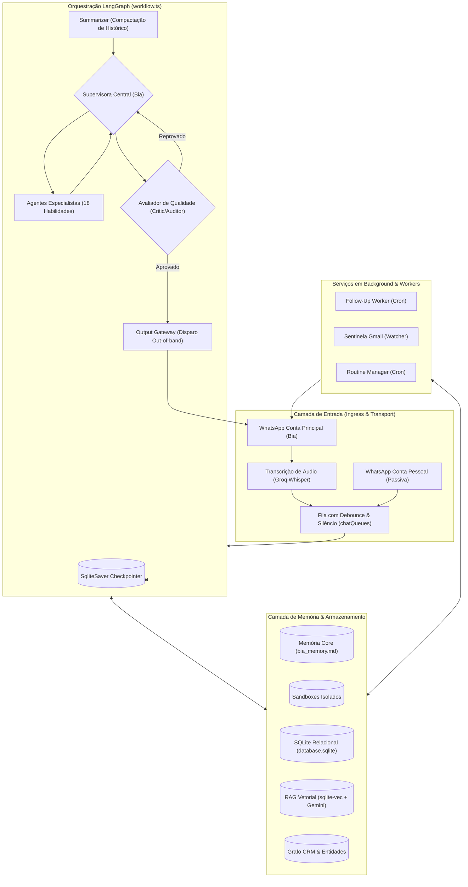

# Arquitetura e Decisões de Projeto da Bia

Bem-vindo à documentação arquitetural da **Bia**, a assistente virtual e executiva pessoal autônoma que opera no WhatsApp.

Este diretório contém as **Decisões Arquiteturais de Registro (ADRs)**, padrões estruturais, fluxos de dados e especificações técnicas de cada subsistema do projeto.

---

## 🗺️ Mapa de Navegação da Arquitetura

A documentação está organizada de forma hierárquica, descendo do nível **Macro** (visão geral, princípios e grafo de orquestração) para o nível **Micro** (especificação detalhada de subsistemas, memórias, segurança e transporte).

| # | Documento | Descrição & Escopo | Principais Módulos de Código |
|---|---|---|---|
| **01** | [Visão Geral & Princípios](01-visao-geral-e-principios.md) | Propósito da Bia, personas, modelo mental e princípios de design | `src/index.ts`, `AGENTS.md` |
| **02** | [Fluxo LangGraph & Estado Compartilhado](02-fluxo-langgraph-e-estado.md) | Orquestração do grafo, nós, arestas condicionais e `AgentState` | `src/graph/workflow.ts`, `src/agents/state.ts` |
| **03** | [Supervisora & Precedência de Cenários](03-supervisora-e-cenarios.md) | O cérebro roteador, árvore de cenários de acesso e prompt dinâmico | `src/agents/supervisor.ts` |
| **04** | [Skills & Tools Registry](04-skills-e-tools-registry.md) | Padrão Skills vs Tools, catálogo dinâmico e níveis de permissão | `src/skills/registry.ts`, `src/skills/types.ts` |
| **05** | [Agentes Especialistas](05-agentes-especialistas.md) | Detalhamento dos 18 agentes, `safeAgentNode` e proteção contra loops | `src/agents/*`, `src/agents/workspace/*` |
| **06** | [Sistema de Memória & RAG Híbrido](06-sistema-de-memoria-e-rag.md) | Memória Core, Sandboxes locais, RAG Vetorial (`sqlite-vec`) e Tópicos | `src/memory/coreMemory.ts`, `src/memory/vectorMemory.ts` |
| **07** | [CRM Pessoal & Grafo de Entidades](07-crm-e-grafo-de-entidades.md) | Grafo de conhecimento de pessoas, projetos, apelidos e resolução de JIDs | `src/memory/entities.ts`, `src/services/entityResolver.ts` |
| **08** | [Transporte WhatsApp & Mensageria](08-transporte-whatsapp-baileys.md) | Multi-contas Baileys (`main`/`personal`), filas com debounce e áudio | `src/transport/whatsapp.ts`, `src/memory/pendingQueue.ts` |
| **09** | [Missões Autônomas com Terceiros](09-missoes-autonomas.md) | Negociação autônoma via WhatsApp, TTL e isolamento comunicacional | `src/memory/missions.ts`, `src/agents/missionAgent.ts` |
| **10** | [Follow-Up & Cobranças](10-follow-up-e-cobrancas.md) | Motor de cobranças (`waiting_for_them` e `promised_by_me`) e worker cron | `src/memory/followUps.ts`, `src/services/followUp/*` |
| **11** | [Sentinela de E-mails do Gmail](11-sentinela-de-email.md) | Varredura contínua de inbox, filtro heurístico e regras de descarte | `src/services/emailSentinel/*`, `src/agents/emailSentinelAgent.ts` |
| **12** | [Avaliação de Qualidade & Segurança](12-avaliacao-qualidade-e-seguranca.md) | Nó `evaluator`, groundedness audit, `outputGateway` e tool seals | `src/agents/evaluator.ts`, `src/agents/outputGateway.ts` |
| **13** | [Banco de Dados & Persistência](13-banco-de-dados-e-persistencia.md) | Catálogo de tabelas SQLite, índices, checkpointer e integridade | `database.sqlite`, `src/utils/dbMonitor.ts` |
| **14** | [Observabilidade, API & Debugger](14-observabilidade-api-e-debugger.md) | Logging estruturado JSONL, SSE endpoint e frontend `bia-debugger` | `src/utils/logger.ts`, `src/api/server.ts`, `bia-debugger/` |
| **15** | [Guia de Evolução & Manutenção](15-guia-de-evolucao-e-manutencao.md) | Protocolo prático para IAs e humanos adicionarem novas funcionalidades | `tests/`, `AGENTS.md` |

---

## 🏛️ Diagrama Macro da Arquitetura

---

## 🎯 Como Utilizar esta Documentação

1. **Para Entendimento Rápido:** Comece lendo [01-visao-geral-e-principios.md](01-visao-geral-e-principios.md), [02-fluxo-langgraph-e-estado.md](02-fluxo-langgraph-e-estado.md) e [03-supervisora-e-cenarios.md](03-supervisora-e-cenarios.md).
2. **Para Criar um Novo Especialista / Ferramenta:** Siga o passo a passo em [15-guia-de-evolucao-e-manutencao.md](15-guia-de-evolucao-e-manutencao.md) e consulte [04-skills-e-tools-registry.md](04-skills-e-tools-registry.md) e [05-agentes-especialistas.md](05-agentes-especialistas.md).
3. **Para Trabalhar com Memória e RAG:** Leia [06-sistema-de-memoria-e-rag.md](06-sistema-de-memoria-e-rag.md) e [07-crm-e-grafo-de-entidades.md](07-crm-e-grafo-de-entidades.md).
4. **Para Agentes de IA:** O arquivo [`AGENTS.md`](file:///Users/luiztordin/Code/biatordin/AGENTS.md) na raiz do projeto é a instrução mandatória do comportamento da IA; este diretório `docs/architecture/` é o detalhamento de referência técnica que **deve ser mantido atualizado a cada evolução**.
